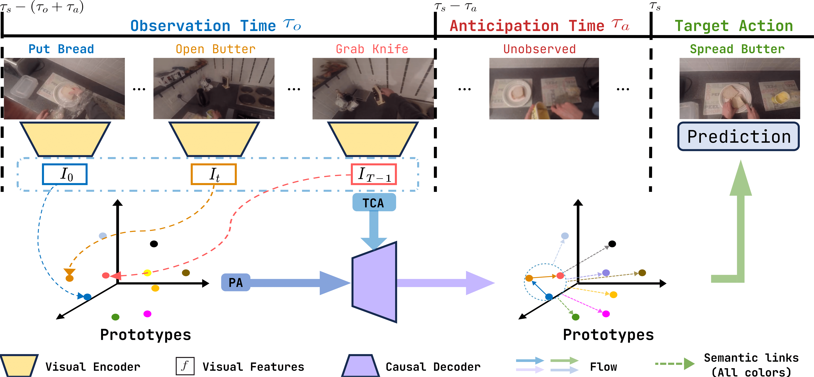

# Semantically Guided Representation Learning for Egocentric Action Anticipation

Paper: [link](https://arxiv.org/html/2407.02309v1)

Weights are coming soon; please contact [diko@di.uniroma1.it](diko@di.uniroma1.it) if you need them sooner.



### Environment Setup
We offer two alternative environments, a conda env and a docker image (the latter recommended).
The experiments are run on 2 V100 GPU and an RTX4090. To install the codebase and set the environment execute the following command:
```bash
$ git clone git@github.com:ADiko1997/S-GEAR.git
$ cd S-GEAR/Docker
$ docker build -f ./Dockerfile -t {user}/{repo}:{tag} .
$ conda env create -f env.yaml python=3.8
$ conda activate sgear
```
You should build either docker or conda environment. Additionally, we release pre-compiled docker image that can be obtaine using the following command:
```bash
$ docker pull diko1997/dlenv:v1.0
```

## Generate Prototypes

S-GEARis oreiented on using prototyes to define action semantic relationships. Specifically there are two types of prototypes, language prototypes and visual prototypes. The former are fixed and generated through Sentence Transformer executing the following commands:
```bash
$ python3 generate_lang_prototypes.py --dataset epic100 --label_file {relative_path_to}/actions_epic100.csv

```
This commmand will generate a file named encodings_epic100.pth and similarities_epic100.pth which than has to be set in the config files i.e., [`conf/dataset/epic_kitchens100/common.yaml`](conf/dataset/epic_kitchens100/common.yaml) or other corresponding config files in conf/dataset/epic_kitchens100. The same procedure can be used for all datasets with dataset keywords in [epic55, epic100, egdea, 50Salads].
For visual prototypes on the other hand one has to first train the network for action recognition as follows:
```bash
$ python launch.py -c expts/ek100_SGEAR_vit_AR.txt -l
```
Afterward, the file [expts/ek100_SGEAR_vit_AR.txt](expts/ek100_SGEAR_vit_AR.txt) has to be modified setting the flag eval.store_embeddings=True, eval.store_embeddings_path=${cwd}/{file}.pth and run the following command:
```bash
$ python launch.py -c expts/ek100_SGEAR_vit_AR.txt -l -t
``` 
You can select from which split to extract the prototypes modifying the data_val variable in the TXT file.
### Set up RULSTM codebase

If you plan to use EPIC-Kitchens datasets,
you might need the train/test splits and evaluation code from RULSTM. This is also needed
if you want to extract RULSTM predictions for test submissions.

```bash
$ cd external
$ git clone git@github.com:fpv-iplab/rulstm.git; cd rulstm
$ git checkout 57842b27d6264318be2cb0beb9e2f8c2819ad9bc
$ cd ../..
```

## Datasets

The code expects the data in the `DATA/` folder. You can also symlink it to
a different folder on a faster/larger drive. Inside it will contain following folders:
1) `videos/` which will contain raw videos
2) `external/` which will contain pre-extracted features from prior work
3) `extracted_features/` which will contain other extracted features
4) `pretrained/` which contains pretrained models, eg from TIMM

The paths to these datasets are set
in files like [`conf/dataset/epic_kitchens100/common.yaml`](conf/dataset/epic_kitchens100/common.yaml)
so you can also update the paths there instead.

### EPIC-Kitchens

To train on top of pre-extracted features, you can download the
features from RULSTM into `DATA/external/rulstm/RULSTM/data_full` for [EK55](https://github.com/fpv-iplab/rulstm/blob/master/RULSTM/scripts/download_data_ek55_full.sh) and
`DATA/external/rulstm/RULSTM/ek100_data_full`
for [EK100](https://github.com/fpv-iplab/rulstm/blob/master/RULSTM/scripts/download_data_ek100_full.sh).
If you plan to train models on features extracted from a irCSN-152 model
finetuned from IG65M features, you can download AVT pre-extracted features
from [here](https://dl.fbaipublicfiles.com/avt/datasets/ek100/ig65m_ftEk100_logits_10fps1s/rgb/data.mdb) into `DATA/extracted_features/ek100/igm/` or [here](https://dl.fbaipublicfiles.com/avt/datasets/ek55/ig65m_ftEk55train_logits_25fps/rgb/data.mdb) into `DATA/extracted_features/ek55/igm/`.

To train S-GEAR end-to-end, you need to download the raw videos from [EPIC-Kitchens](https://data.bris.ac.uk/data/dataset/2g1n6qdydwa9u22shpxqzp0t8m). They can be organized as you wish, but this
is how my folders are organized:

```
DATA
├── videos
│   ├── EpicKitchens
│   │   └── videos_ht256px
│   │       ├── train
│   │       │   ├── P01
│   │       │   │   ├── P01_01.MP4
│   │       │   │   ├── P01_03.MP4
│   │       │   │   ├── ...
│   │       └── test
│   │           ├── P01
│   │           │   ├── P01_11.MP4
│   │           │   ├── P01_12.MP4
│   │           │   ├── ...
│   │           ...
│   ├── EpicKitchens100
│   │   └── videos_extension_ht256px
│   │       ├── P01
│   │       │   ├── P01_101.MP4
│   │       │   ├── P01_102.MP4
│   │       │   ├── ...
│   │       ...
├── external
│   └── rulstm
│       └── RULSTM
│           └── ek100_data_full
│               ├── rgb
│               ├── obj
│               └── flow
└── extracted_features
    ├── ek100
        └── igm

```

If you use a different organization, you would need to edit the train/val
dataset files, such as [`conf/dataset/epic_kitchens100/anticipation_train.yaml`](conf/dataset/epic_kitchens100/anticipation_train.yaml), [`conf/dataset/epic_kitchens100/anticipation_val.yaml`](conf/dataset/epic_kitchens100/anticipation_val.yaml) and [`conf/dataset/epic_kitchens100/common.yaml`](conf/dataset/epic_kitchens100/common.yaml). Sometimes the values are overriden
in the TXT config files, so might need to change there too. The `root` property takes a list of
folders where the videos can be found, and it will search through all of them
in order for a given video. Note that we resized the EPIC videos to
256px height for faster processing; you can use [`sample_scripts/resize_epic_256px.sh`](sample_scripts/resize_epic_256px.sh) script for the same.

## Training and evaluating models

If you want to train S-GEAR models, you would need pre-trained models from
[`timm`](https://github.com/rwightman/pytorch-image-models/tree/8257b86550b8453b658e386498d4e643d6bf8d38).
We have experiments that use the following models:

```bash
$ mkdir DATA/pretrained/TIMM/
$ wget https://github.com/rwightman/pytorch-image-models/releases/download/v0.1-vitjx/jx_vit_base_p16_384-83fb41ba.pth -O DATA/pretrained/TIMM/vit_base_384.pth
$ wget https://github.com/rwightman/pytorch-image-models/releases/download/v0.1-vitjx/jx_vit_base_patch16_224_in21k-e5005f0a.pth -O DATA/pretrained/TIMM/jx_vit_base_224_in21k.pth
$ wget https://github.com/rwightman/pytorch-image-models/releases/download/v0.1-vitjx/jx_vit_base_p16_224-80ecf9dd.pth -O DATA/pretrained/TIMM/vit_base_p16_224.pth
```

The code uses [`hydra 1.0`](https://hydra.cc/) for configuration with [`submitit`](https://github.com/facebookincubator/submitit) plugin for jobs
via SLURM. We provide a `launch.py` script that is a wrapper around the
training scripts and can run jobs locally or launch distributed jobs. The
configuration overrides for a specific experiment is defined by a TXT file.
You can run a config by:

```bash
$ python launch.py -c expts/ek100_SGEAR_vit.txt
```
where `expts/ek100_SGEAR_vit.txt` can be replaced by any TXT config file.
For TXT files different from ek100_SGEAR_vit.txt it is required that you first train S-GEAR
end-to-end to use the pre-trained prototypes and temporal decoder in order to reproduce results reported on the paper.

By default, the launcher will launch the job to a SLURM cluster. However,
you can run it locally using one of the following options:

1. `-g` to run locally in debug mode with 1 GPU and 0 workers. Will allow you to place
`pdb.set_trace()` to debug interactively.
2. `-l` to run locally using as many GPUs on the local machine.

This will run the training, which will run validation every few epochs. You can
also only run testing using the `-t` flag. When running testing for a pre-trained model,
don't forget to set the checkpoint to load weights from, using something like this in the 
txt experiment config:
```
train.init_from_model=[[path/to/checkpoint.pth]]
```

The outputs will be stored in `OUTPUTS/<path to config>`. This would include
tensorboard files that you can use to visualize the training progress.

## Model Zoo


### EPIC-Kitchens-100


| Backbone | Class-mean <br/> Recall@5 (Actions) | Config | Model |
|----------|-------------------------------|--------|-----|
| S-GEAR [ViT] | 18.3 | `expts/ek100_SGEAR_vit.txt` | [link](TBA)|
| S-GEAR [TSN] (RGB) | 14.9 | `expts/ek100_SGEAR_tsn.txt` | [link](TBA)|
| S-GEAR [TSN] (Obj) | 11.4 | `expts/ek100_SGEAR_tsn_obj.txt` | [link](TBA)|
| S-GEAR [TSN] (Flow)| 7.9 | `expts/ek100_SGEAR_tsn_flow.txt` | [link](TBA)|
| S-GEAR (irCSN) | 13.3 | `expts/ek100_SGEAR_igm.txt` | [link](TBA)|


### Late fusing predictions

For comparison to methods that use multiple modalities, you can late fuse
predictions from multiple models using functions from `notebooks/utils.py`.
For example, to compute the late fused performance reported in Table 1 (d) (Val)
(obtains 18.9 recall@5 for actions):

```python
from notebooks.utils import *
CFG_FILES = [
    ('expts/ek100_SGEAR_vit.txt', 0),
    ('expts/ek100_SGEAR_tsn_obj.txt', 0),
]
WTS = [2.5, 0.5]
print_accuracies_epic(get_epic_marginalize_late_fuse(CFG_FILES, weights=WTS)[0])
```
## Cite BibTex
If you find our work useful, cite through the following BibText
```
@article{diko2024semantically,
  title={Semantically Guided Representation Learning For Action Anticipation},
  author={Diko, Anxhelo and Avola, Danilo and Prenkaj, Bardh and Fontana, Federico and Cinque, Luigi},
  journal={arXiv preprint arXiv:2407.02309},
  year={2024}
}
```

## License
This codebase is released under the license terms specified in the [LICENSE](LICENSE) file. Any imported libraries, datasets, or other code follows the license terms set by respective authors.


## Acknowledgements
The codebase was built on top of [`facebookresearch/AVT`](https://github.com/facebookresearch/AVT). Many thanks to [Furnari et al.](https://github.com/fpv-iplab/rulstm) for prior work on RULSTM an the release of evaluation code.
